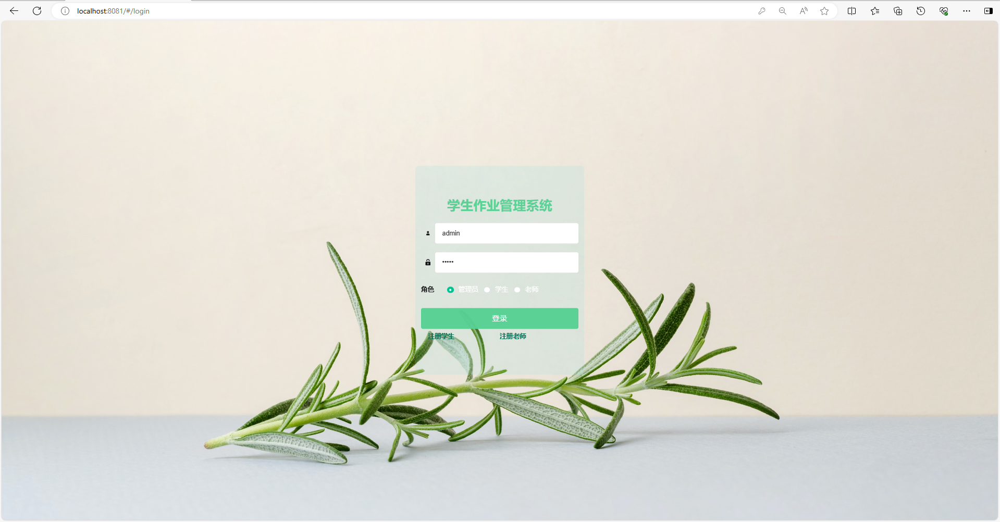
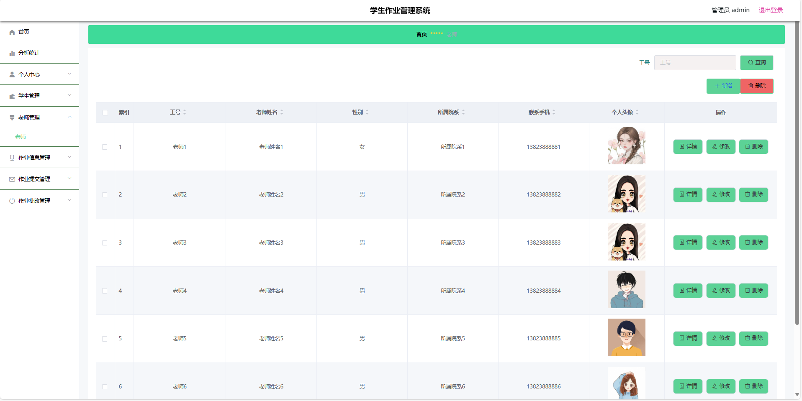
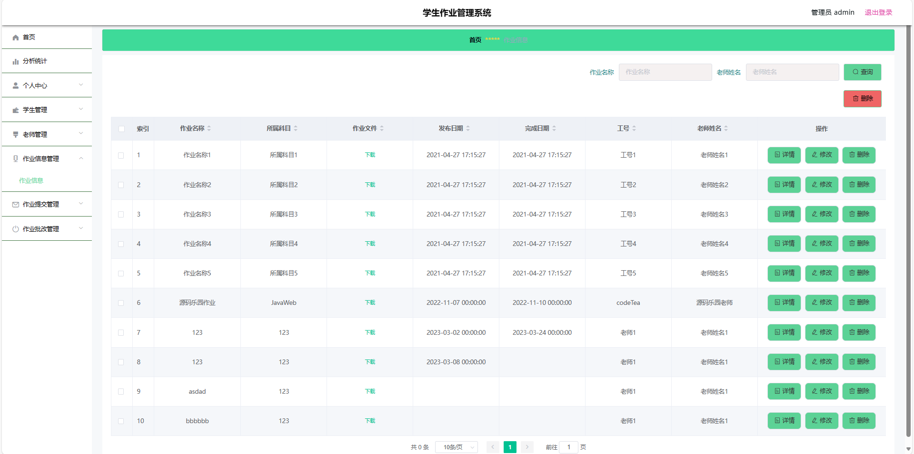
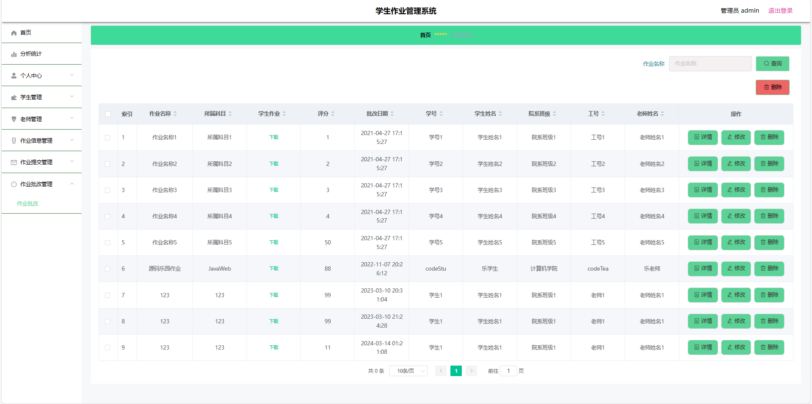

# 作业批改管理系统

### 9.9￥ 获取完整源码+sql，需要的加Q：3808981644 微信：qszard26
### 有问题，或者需要协助调试运行项目的也可联系

## 一、介绍

基于springboot+vue的前后端分离作业批改管理系统

开发语言：java

运行环境:idea或eclipse vscode 数据库:mysql

前端技术：Vue、ELementUI、echarts

后端技术：SpringBoot、Mybatis-Plus

角色：管理员、教师、学生

管理员：登录、分析统计、个人中心、学生管理、老师管理、作业信息管理、作业提交管理、作业批改管理

教师：注册、登录、分析统计、个人中心、作业信息管理（新增、修改、删除）、作业提交管理（批改作业）、作业批改管理（查看改完的作业详情）

学生：注册、登录、分析统计、个人中心、作业信息管理、作业提交管理、作业批改管理（查看教师改完的作业详情）

## 二、部分页面截图展示

### 9.9￥ 获取完整源码+sql，需要的加Q：3808981644 微信：qszard26
### 有问题，或者需要协助调试运行项目的也可联系

